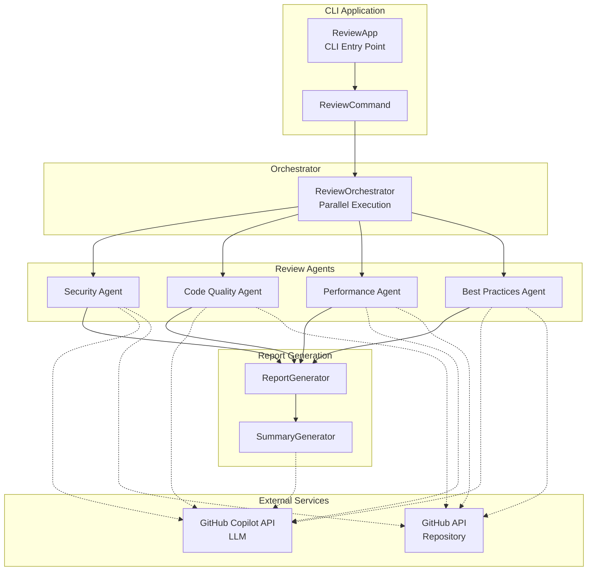

# Multi-Agent Code Reviewer

A parallel code review application using multiple AI agents with GitHub Copilot SDK for Java.

## Features

- **Parallel Multi-Agent Execution**: Simultaneous review from security, code quality, performance, and best practices perspectives
- **Flexible Agent Definitions**: Define agents in GitHub Copilot format (.agent.md)
- **External Configuration Files**: Agent definitions can be swapped without rebuilding
- **LLM Model Selection**: Use different models for review, report generation, and summary generation
- **Structured Review Results**: Consistent format with Priority (Critical/High/Medium/Low)
- **Executive Summary Generation**: Management-facing report aggregating all review results
- **GraalVM Support**: Native binary generation via Native Image

## Requirements

- **GraalVM 25.0.2** (Java 21)
- GitHub Copilot CLI 0.0.401 or later
- GitHub token (for repository access)

### Installing GraalVM

Using SDKMAN:

```bash
sdk install java 25.0.2-graal
sdk use java 25.0.2-graal

# Auto-switch in project directory
cd multi-agent-reviewer  # GraalVM is automatically selected via .sdkmanrc
```

## Installation

```bash
# Clone the repository
git clone https://github.com/your-org/multi-agent-reviewer.git
cd multi-agent-reviewer

# Build (JAR file)
mvn clean package

# Build native image (optional)
mvn clean package -Pnative
```

## Usage

### Basic Usage

```bash
# Run review with all agents
java -jar target/multi-agent-reviewer-1.0.0-SNAPSHOT.jar \
  run \
  --repo owner/repository \
  --all

# Run only specific agents
java -jar target/multi-agent-reviewer-1.0.0-SNAPSHOT.jar \
  run \
  --repo owner/repository \
  --agents security,performance

# Explicitly specify LLM models
java -jar target/multi-agent-reviewer-1.0.0-SNAPSHOT.jar \
  run \
  --repo owner/repository \
  --all \
  --review-model gpt-4.1 \
  --summary-model claude-sonnet-4

# List available agents
java -jar target/multi-agent-reviewer-1.0.0-SNAPSHOT.jar \
  list
```

### Run Options

| Option | Short | Description | Default |
|--------|-------|-------------|---------|
| `--repo` | `-r` | Target repository (required) | - |
| `--agents` | `-a` | Agents to run (comma-separated) | - |
| `--all` | - | Run all agents | false |
| `--output` | `-o` | Output directory | `./report` |
| `--agents-dir` | - | Additional agent definition directory | - |
| `--token` | - | GitHub token | `$GITHUB_TOKEN` |
| `--parallelism` | - | Number of parallel executions | 4 |
| `--no-summary` | - | Skip summary generation | false |
| `--model` | - | Default model for all stages | - |
| `--review-model` | - | Model for review | Agent config |
| `--report-model` | - | Model for report generation | review-model |
| `--summary-model` | - | Model for summary generation | claude-sonnet-4 |
| `--help` | `-h` | Show help | - |
| `--version` | `-V` | Show version | - |

### List Subcommand

Displays a list of available agents. Additional directories can be specified with `--agents-dir`.

### Environment Variables

```bash
export GITHUB_TOKEN=your_github_token
```

### Output Example

```
./report/
├── security_260204.md
├── code-quality_260204.md
├── performance_260204.md
├── best-practices_260204.md
└── executive_summary_260204.md
```

## Configuration

Customize application behavior via `application.yml`.

```yaml
reviewer:
  orchestrator:
    default-parallelism: 4      # Default parallel execution count
    timeout-minutes: 10         # Review timeout (minutes)
  mcp:
    github:
      type: http
      url: https://api.githubcopilot.com/mcp/
      tools:
        - "*"
      auth-header-name: Authorization
      auth-header-template: "Bearer ${token}"
  models:
    review-model: claude-sonnet-4    # Model for review
    report-model: claude-sonnet-4    # Model for report generation
    summary-model: claude-sonnet-4   # Model for summary generation
```

### Configuration Options

| Option | Description | Default |
|--------|-------------|--------|
| `reviewer.orchestrator.default-parallelism` | Default parallel execution count | 4 |
| `reviewer.orchestrator.timeout-minutes` | Review timeout (minutes) | 10 |
| `reviewer.mcp.github.url` | GitHub MCP Server URL | https://api.githubcopilot.com/mcp/ |
| `reviewer.mcp.github.tools` | Tools to use | ["*"] |
| `reviewer.models.review-model` | LLM model for review | claude-sonnet-4 |
| `reviewer.models.report-model` | LLM model for report generation | claude-sonnet-4 |
| `reviewer.models.summary-model` | LLM model for summary generation | claude-sonnet-4 |

## Agent Definitions

### Agent Directories

The following directories are automatically searched:

- `./agents/` - Default directory
- `./.github/agents/` - GitHub Copilot format directory

Additional directories can be specified with the `--agents-dir` option.

### Agent Definition File (`.agent.md`)

In `Review Prompt`, you can use placeholders: `${repository}`, `${displayName}`, `${focusAreas}`.

```markdown
---
name: security
description: "Security Review"
model: claude-sonnet-4
---

# Security Review Agent

## System Prompt

You are a security-focused code reviewer.
As an experienced security engineer, you identify vulnerabilities in the code.

## Review Prompt

Please perform a code review of the following GitHub repository.

**Target Repository**: ${repository}

Analyze all source code in the repository and identify issues from your specialty perspective (${displayName}).

Pay special attention to the following points:
${focusAreas}

## Focus Areas

- SQL Injection
- XSS Vulnerabilities
- Authentication/Authorization Issues

## Output Format

Please output the review results in the following format.
```

### Default Agents

| Agent | Description |
|-------|-------------|
| `security` | Security vulnerabilities, authentication/authorization, secrets |
| `code-quality` | Readability, complexity, SOLID principles, tests |
| `performance` | N+1 queries, memory leaks, algorithm efficiency |
| `best-practices` | Language/framework-specific best practices |

## Review Result Format

Each finding is output in the following format:

| Field | Description |
|-------|-------------|
| Title | Concise title describing the issue |
| Priority | Critical / High / Medium / Low |
| Summary | Description of the problem |
| Impact if Not Fixed | Risk if left unaddressed |
| Location | File path and line numbers |
| Recommended Action | Specific fix (including code examples) |
| Benefit | Improvement from the fix |

### Priority Criteria

- **Critical**: Security vulnerabilities, data loss, production outages. Immediate action required
- **High**: Serious bugs, performance issues. Prompt action needed
- **Medium**: Code quality issues, reduced maintainability. Address in planned manner
- **Low**: Style issues, minor improvement suggestions. Fix when time permits

## GraalVM Native Image

To build as a native binary:

```bash
# Build native image
mvn clean package -Pnative

# Run
./target/review run --repo owner/repository --all
```

## Architecture



## Project Structure

```
multi-agent-reviewer/
├── pom.xml                              # Maven configuration
├── .sdkmanrc                            # SDKMAN GraalVM configuration
├── agents/                              # Agent definitions
│   ├── security.agent.md
│   ├── code-quality.agent.md
│   ├── performance.agent.md
│   └── best-practices.agent.md
├── .github/agents/                      # Alternative agent directory
│   ├── security.agent.md
│   ├── code-quality.agent.md
│   ├── performance.agent.md
│   └── best-practices.agent.md
└── src/main/java/dev/logicojp/reviewer/
    ├── ReviewApp.java                   # CLI entry point
    ├── ReviewCommand.java               # review subcommand
    ├── ListAgentsCommand.java           # list subcommand
    ├── agent/
    │   ├── AgentConfig.java             # Config model
    │   ├── AgentConfigLoader.java       # Config loader
    │   ├── AgentMarkdownParser.java     # .agent.md parser
    │   └── ReviewAgent.java             # Review agent
    ├── config/
    │   ├── ModelConfig.java             # LLM model config
    │   ├── GithubMcpConfig.java         # GitHub MCP config
    │   └── OrchestratorConfig.java      # Orchestrator config
    ├── orchestrator/
    │   └── ReviewOrchestrator.java      # Parallel execution control
    ├── report/
    │   ├── ReviewResult.java            # Result model
    │   ├── ReportGenerator.java         # Individual report generation
    │   └── SummaryGenerator.java        # Summary generation
    └── service/
        ├── AgentService.java            # Agent management
        ├── CopilotService.java          # Copilot SDK integration
        ├── ReportService.java           # Report generation
        └── ReviewService.java           # Review execution
```

## License

MIT License
